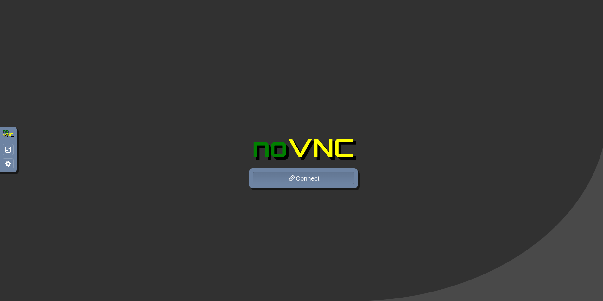
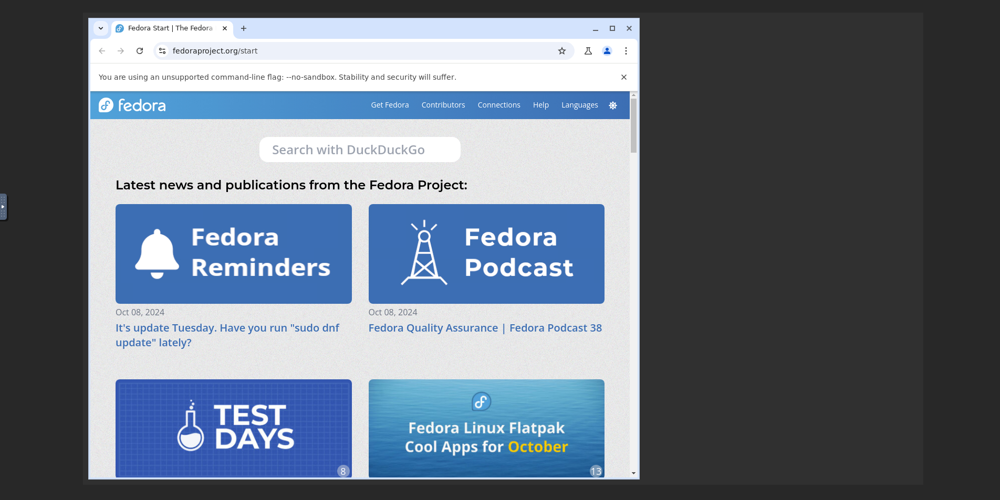
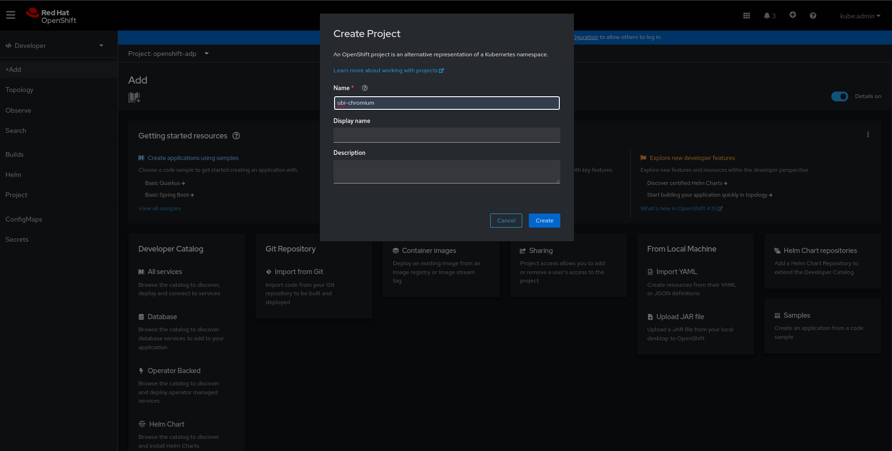
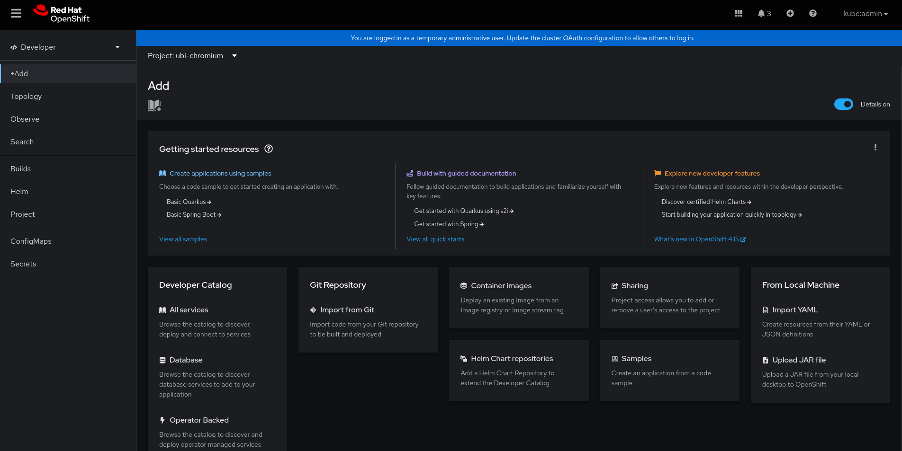
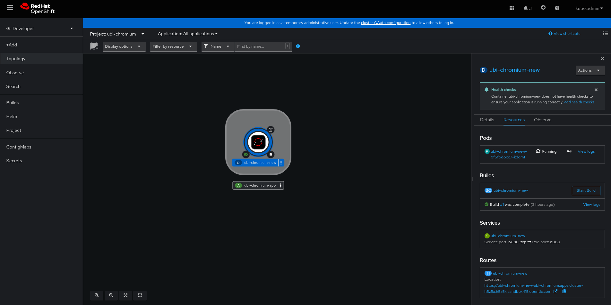

# Creating UBI image with Chromium

This project was created to address the need to run Chromium in UBI containers.

Since UBI is optimized for containerized environments, many of its libraries and resources, including the graphical environment, have been removed. This posed a challenge in assembling this solution.

For this lab, we will use the following tools: Podman and noVNC.


Podman (short for Pod Manager) is an open-source container engine developed by Red Hat that allows users to run, manage, and build containers and container images. It is designed to be a more secure and flexible alternative to Docker, offering several key features that make it popular in containerized environments.

The noVNC project is an open-source, web-based VNC (Virtual Network Computing) client that allows you to control remote desktops through a web browser. It uses HTML5 and WebSockets to provide a seamless experience for interacting with remote systems, without needing to install any additional software on the client side.


# Building Containerfile in local machine

First let's clone the project.

`git clone https://github.com/LeandroJan/ubi-chromium.git`

Then you need to build the image using Containerfile.

`podman build -t <image_name> .`

If you want to build an image that has UBI9 as a base, you need to pass some parameters.

`podman build -t <image_name> --build-arg RHEL_ORG=<number_here> --build-arg RHEL_AK=<ak_here> -f Containerfile.redhat`

The output of the podman images command should contain the UBI image and its corresponding layers.

[]


Afterwards, it is necessary to initialize the container based on the build image.

```
podman run -d -p 6080:6080 -e VNC_PASSWORD=<your_password> -e VNC_GEOMETRY=<default is 1280X800> CHROMIUM_USER_FLAGS="--disable-dev-shm-usage --disable-gpu" --name <container_name> <image_name or id>
```

The container must have started listening on port 6080 (default for noVNC).

[]


Let's access noVNC via browser on the local machine.

`http://localhost:<chosen_published_port>`


At this moment, the noVNC connection screen is displayed.



Click the Connect button and enter the access password defined previously during the build process. The result should be an environment in which Chromium is running.




## Deploying this solution on Red Hat OpenShift 

First of all, let's start by briefly explaining what OpenShift is.

Red Hat OpenShift is an enterprise-grade Kubernetes platform designed for building, deploying, and managing containerized applications at scale. It provides a full-stack automated environment for managing containers, combining Kubernetes with developer-friendly tools and additional enterprise features. 

The following approach demonstrates how to prepare the Red Hat OpenShift environment to create a UBI container in which you can run a version of chromium.

You need to create a project to isolate the context of this lab. For this example, the project is called _ubi-chromium_.



Next, we will prepare the deployment of our image using the "Import from Git" option.



The information to be filled in on the form is as follows:

* Git Repo URL: _https://github.com/LeandroJan/ubi-chromium_
* Application: _ubi-chromium-app_
* Name: _ubi-chromium-new_
* Environment variables (Inside Show advanced Deployment option): _VNC_PASSWORD_:_redhat123_
* Target Port: _6080_
* Then _click Create Button_.

After the build completes successfully, the pod icon on the OpenShift screen should be dark blue, and the pod should be in Running status.



When accessing the route assigned to the application service, the noVNC connection screen is displayed.


Click the Connect button and enter the access password defined previously during the build process. The result should be an environment in which Chromium is running.


The environment has an integrated xterm terminal so you can run commands on the UBI image.
